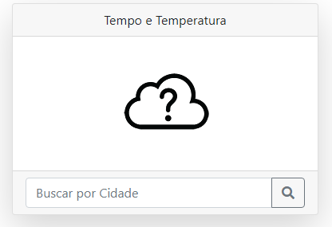
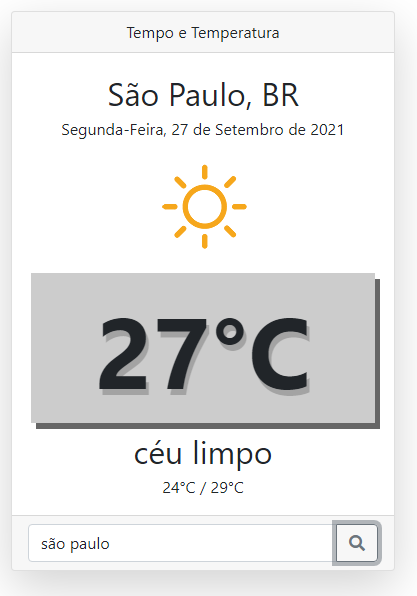

# weather-aplication
Aplicação de previsão de tempo desenvolvida para o teste técnico na 2B Digital 

  
 

## Tecnologias utilizadas
<ul>
 <li>HTML 5</li>
 <li>CSS 3</li>
 <li>Javascript</li>
</ul>

## Como executar a aplicação
1. 
Faça um clone do repositorio utilizando o comando abaixo:

    <code>git clone https://github.com/leansdr/weather-aplication.git</code>
2. Faça o cadastro no site <a href="https://openweathermap.org/">Open Weather Map</a> e pegue a chave da API 
3. Entre na pasta weather-app, abra o arquivo script.js e inclua na chave key a chave obtida na API OpenWeatherMap
4. Após os passos acima, clique no arquivo index.html
